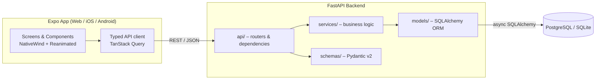

# TableFlow

**Modern Restaurant Reservation & Table Management System**

An async REST API (FastAPI) and a cross-platform client (Web + iOS + Android via Expo) that lets guests book a table in seconds and gives restaurant staff a live view of the floor — with **guaranteed protection against double-booking**.

> **Status:** Phase 1 – the backend core is implemented: reservations with anti-double-booking, availability search, and minimal restaurant/table management. Authentication and the frontend are planned (see [Roadmap](#roadmap)).

---

## Business Value

| Problem | How TableFlow solves it |
|---|---|
| Double-booked tables cause conflicts, lost trust and lost revenue | Overlap validation + row-level locking + a database-level constraint make double-booking impossible, even under concurrent requests |
| Phone/paper reservations are slow and error-prone | Instant availability search and self-service booking from any device |
| No-shows and idle tables hurt utilisation | Clear reservation lifecycle (`pending → confirmed → seated → completed / cancelled / no_show`) enables analytics on occupancy and no-show rate |
| Staff need a fast, glanceable tool during service | Floor-plan view, keyboard shortcuts on web and animated state transitions per table |
| Different venues, different rules | Configurable opening hours, table capacity and default reservation duration |

## Tech Stack

- **Backend:** Python 3.11+, FastAPI, Pydantic v2, async SQLAlchemy 2.0, Alembic, Pytest
- **Database:** SQLite (development), PostgreSQL 16 (Docker / production)
- **Frontend:** React Native + Expo (Expo Router), TypeScript, NativeWind
- **UI/UX:** React Native Reanimated, Moti, Gesture Handler; dark-slate design with light/dark mode
- **Tooling:** Docker Compose, Ruff, mypy, Conventional Commits

## Architecture



Layering rules: routers are thin and only handle HTTP concerns; all business rules live in `services/`; `models/` describe persistence; `schemas/` define the validated API contract.

## Preventing Double-Booking

Double-booking is a race condition: two requests check availability at the same time, both see the table as free, and both insert. TableFlow defends against it in three layers:

1. **Validation (service layer).** A reservation occupies the half-open interval `[start_at, end_at)`. Two reservations for the same table conflict when `new.start < existing.end AND new.end > existing.start`, considering only active statuses (`pending`, `confirmed`, `seated`). Back-to-back bookings (one ends exactly when the next starts) are allowed. Party size must not exceed table capacity and the slot must fall within opening hours.
2. **Serialisation (transaction).** The check and the insert run in a single transaction that first statement locks the target table: `SELECT … FOR UPDATE` on PostgreSQL (a row lock, so other tables are unaffected), and a no-op `UPDATE` on SQLite (which has no row locks, so this takes the database write lock). Concurrent attempts for the same table are queued instead of interleaved.
3. **Database constraint (last line of defence).** On PostgreSQL an exclusion constraint guarantees that overlapping active reservations can never be stored, regardless of application bugs:

   ```sql
   CREATE EXTENSION IF NOT EXISTS btree_gist;
   ALTER TABLE reservations
     ADD CONSTRAINT no_overlapping_reservations
     EXCLUDE USING gist (
       table_id WITH =,
       tstzrange(start_at, end_at, '[)') WITH &&
     ) WHERE (status IN ('pending', 'confirmed', 'seated'));
   ```

   A violation is translated into `409 Conflict` with a machine-readable error code.

The behaviour is covered by integration tests that fire many concurrent booking requests (identical and staggered-overlapping slots) and assert that exactly one succeeds and that stored reservations never overlap. With `TEST_POSTGRES_URL` set, the same suite also runs against PostgreSQL, including a test that inserts overlapping rows directly and expects the database to reject them.

## API Endpoints

Base path: `/api/v1`. Domain errors share one shape: `{"error": {"code": "slot_conflict", "message": "..."}}`.
Authentication and role checks arrive in Phase 2, so the write endpoints are open until then.

| Method | Endpoint | Description | Status |
|---|---|---|---|
| `GET` | `/health` | Liveness check | ✅ |
| `POST` | `/restaurants` | Create a restaurant (`opens_at` / `closes_at`, IANA `timezone`) | ✅ |
| `GET` | `/restaurants/{id}` | Restaurant details | ✅ |
| `POST` | `/restaurants/{id}/tables` | Add a table (`label`, `capacity`) | ✅ |
| `GET` | `/restaurants/{id}/tables` | List tables | ✅ |
| `GET` | `/restaurants/{id}/availability?start_at&end_at&party_size` | Free tables for a slot, smallest fitting first | ✅ |
| `POST` | `/reservations` | Create a reservation (anti-double-booking) | ✅ |
| `GET` | `/reservations/{id}` | Reservation details | ✅ |
| `POST` | `/reservations/{id}/cancel` | Cancel a reservation and free the slot | ✅ |
| `POST` / `GET` | `/auth/register`, `/auth/login`, `/auth/me` | Registration, JWT login, profile | Phase 2 |
| `GET` / `PATCH` | `/restaurants`, `/restaurants/{id}` | List / update restaurants (admin) | Phase 2 |
| `PATCH` / `DELETE` | `/tables/{id}` | Update / remove a table (admin) | Phase 2 |
| `GET` / `PATCH` | `/reservations`, `/reservations/{id}` | List with filters / reschedule | Phase 2 |
| `PATCH` | `/reservations/{id}/status` | Staff status changes (seated, completed, no_show) | Phase 2 |

Error codes: `slot_conflict`, `invalid_reservation_state`, `duplicate_table_label` (409); `capacity_exceeded`, `outside_opening_hours`, `reservation_too_soon` (422); `not_found` (404). Malformed requests return FastAPI's standard `422`.

Interactive docs are served at `/docs` (Swagger UI) and `/redoc`.

### Reservation rules

- Datetimes must be timezone-aware; they are stored and returned in UTC.
- `end_at` is optional and defaults to the restaurant's `default_duration_minutes`.
- A reservation must fit within one local day's opening hours, evaluated in the restaurant's timezone.
- A reservation must start at least `RESERVATION_MIN_LEAD_TIME_MINUTES` from now.
- New reservations are `confirmed` immediately; the other lifecycle statuses belong to the staff flow in Phase 2.

## Project Structure

```
tableflow/
├── backend/    # FastAPI service (src/api, core, models, schemas, services, tests)
├── frontend/   # Expo app (React Native + NativeWind + Reanimated)
├── docker-compose.yml
├── CLAUDE.md   # working agreements & full directory tree (PL)
└── README.md
```

See [`CLAUDE.md`](CLAUDE.md) for the full directory tree and coding guidelines.

## Getting Started

### Backend

```bash
cd backend
python -m venv .venv
.venv\Scripts\activate          # Windows (Linux/macOS: source .venv/bin/activate)
pip install -r requirements.txt
cp .env.example .env
alembic upgrade head            # create the schema (SQLite file by default)
uvicorn src.main:app --reload   # http://localhost:8000/docs
pytest                          # SQLite; set TEST_POSTGRES_URL to also run against PostgreSQL
```

### Frontend

```bash
cd frontend
npm install
npx expo start                  # press w for web, i for iOS, a for Android
```

### Docker (backend + PostgreSQL)

```bash
docker compose up --build       # applies migrations, then serves http://localhost:8000
```

> The frontend lands in Phase 3; its commands describe the target workflow.

## Roadmap

- [x] **Phase 0** – Project structure and documentation
- [x] **Phase 1** – FastAPI + database setup, reservation validation and anti-double-booking
- [ ] **Phase 2** – Authentication (JWT), restaurants and tables management
- [ ] **Phase 3** – Expo + NativeWind app shell, navigation, theming
- [ ] **Phase 4** – Floor plan, booking flow, Reanimated/Moti animations
- [ ] **Phase 5** – Keyboard shortcuts, polish, CI, deployment

## Conventions

- [Conventional Commits](https://www.conventionalcommits.org/) (`feat:`, `fix:`, `docs:` …)
- Type hints everywhere (mypy) and strict TypeScript
- Ruff for linting and formatting

## License

TBD.
