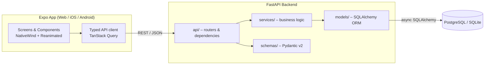

# TableFlow

[](https://github.com/mkazmierski4/tableflow/actions/workflows/backend.yml)
[](https://github.com/mkazmierski4/tableflow/actions/workflows/frontend.yml)

**Modern Restaurant Reservation & Table Management System**

An async REST API (FastAPI) and a cross-platform client (Web + iOS + Android via Expo) that lets guests book a table in seconds and gives restaurant staff a live view of the floor — with **guaranteed protection against double-booking**.

> **Status:** Phase 4 – the backend is feature-complete (JWT auth with guest/staff/admin roles, restaurants and tables, availability slots, reservations with anti-double-booking, rescheduling, staff status lifecycle). The Expo app lets a guest discover restaurants, book a table from real availability (with graceful handling of a table taken in the meantime), and view, reschedule and cancel reservations; staff get a floor plan and a day list with keyboard shortcuts, polling and swipe gestures. Polish and deployment are next (see [Roadmap](#roadmap)).

---

## Business Value

| Problem | How TableFlow solves it |
|---|---|
| Double-booked tables cause conflicts, lost trust and lost revenue | Overlap validation + row-level locking + a database-level constraint make double-booking impossible, even under concurrent requests |
| Phone/paper reservations are slow and error-prone | Instant availability search and self-service booking from any device |
| No-shows and idle tables hurt utilisation | Clear reservation lifecycle (`pending → confirmed → seated → completed / cancelled / no_show`) enables analytics on occupancy and no-show rate |
| Staff need a fast, glanceable tool during service | Floor-plan view, keyboard shortcuts on web and animated state transitions per table |
| Different venues, different rules | Configurable opening hours, table capacity and default reservation duration |

## Tech Stack

- **Backend:** Python 3.11+, FastAPI, Pydantic v2, async SQLAlchemy 2.0, Alembic, Pytest
- **Auth:** JWT (PyJWT) with argon2id password hashing (pwdlib), role-based access control
- **Database:** SQLite (development), PostgreSQL 16 (Docker / production)
- **Frontend:** React Native + Expo SDK 57 (Expo Router), TypeScript, NativeWind, TanStack Query; types generated from the API's OpenAPI schema
- **UI/UX:** React Native Reanimated, Moti, Gesture Handler; dark-slate design with light/dark mode
- **Tooling:** Docker Compose, GitHub Actions CI (backend: Ruff, mypy, Pytest on SQLite and PostgreSQL; frontend: tsc, ESLint, Jest, web build), Conventional Commits

## Architecture



Layering rules: routers are thin and only handle HTTP concerns; all business rules live in `services/`; `models/` describe persistence; `schemas/` define the validated API contract.

## Preventing Double-Booking

Double-booking is a race condition: two requests check availability at the same time, both see the table as free, and both insert. TableFlow defends against it in three layers:

1. **Validation (service layer).** A reservation occupies the half-open interval `[start_at, end_at)`. Two reservations for the same table conflict when `new.start < existing.end AND new.end > existing.start`, considering only active statuses (`pending`, `confirmed`, `seated`). Back-to-back bookings (one ends exactly when the next starts) are allowed. Party size must not exceed table capacity and the slot must fall within opening hours.
2. **Serialisation (transaction).** The check and the insert run in a single transaction whose first statement locks the target table: `SELECT … FOR UPDATE` on PostgreSQL (a row lock, so other tables are unaffected), and a no-op `UPDATE` on SQLite (which has no row locks, so this takes the database write lock). Concurrent attempts for the same table are queued instead of interleaved.
3. **Database constraint (last line of defence).** On PostgreSQL an exclusion constraint guarantees that overlapping active reservations can never be stored, regardless of application bugs:

   ```sql
   CREATE EXTENSION IF NOT EXISTS btree_gist;
   ALTER TABLE reservations
     ADD CONSTRAINT no_overlapping_reservations
     EXCLUDE USING gist (
       table_id WITH =,
       tstzrange(start_at, end_at, '[)') WITH &&
     ) WHERE (status IN ('pending', 'confirmed', 'seated'));
   ```

   A violation is translated into `409 Conflict` with a machine-readable error code.

The behaviour is covered by integration tests that fire many concurrent booking requests (identical and staggered-overlapping slots) and assert that exactly one succeeds and that stored reservations never overlap. With `TEST_POSTGRES_URL` set, the same suite also runs against PostgreSQL, including a test that inserts overlapping rows directly and expects the database to reject them.

## Authentication & Roles

Authentication uses short-lived JWT access tokens (HS256, 60 minutes by default, no refresh tokens yet). Passwords are hashed with argon2id. In Swagger UI (`/docs`) use **Authorize** and log in with your e-mail as the username.

| Role | Can do |
|---|---|
| **guest** (default on registration) | Book tables, and view, reschedule and cancel **their own** reservations |
| **staff** (assigned to one restaurant) | Everything a guest can, plus list and manage **all reservations of their restaurant**: change status, move them between tables |
| **admin** | Everything, across all restaurants; manages restaurants, tables and users |

Self-registration always creates a guest. Admins grant roles with `PATCH /users/{id}`; the first admin is created from the command line:

```bash
cd backend
python -m src.cli create-admin --email you@example.com --name "Your Name"   # prompts for a password
```

A reservation the caller may not access is reported as `404` rather than `403`, so its existence is not leaked. Deactivating a user (`is_active=false`) revokes their tokens immediately.

## API Endpoints

Base path: `/api/v1`. Domain errors share one shape: `{"error": {"code": "slot_conflict", "message": "..."}}`. List endpoints return `{"items": [...], "total": n, "limit": n, "offset": n}` and accept `limit` (1–100) and `offset`.

| Method | Endpoint | Description | Access |
|---|---|---|---|
| `GET` | `/health` | Liveness check | public |
| `POST` | `/auth/register` | Register a guest account | public |
| `POST` | `/auth/login` | OAuth2 password login, returns a bearer token | public |
| `GET` | `/auth/me` | Current user | any user |
| `PATCH` | `/users/{id}` | Change role, staff restaurant or `is_active` | admin |
| `GET` | `/restaurants?city=` | List restaurants (paginated), optionally filtered by city (case-insensitive) | public |
| `GET` | `/restaurants/cities` | Cities that have restaurants, for filter pickers | public |
| `POST` | `/restaurants` | Create a restaurant (`name`, `city`, `opens_at` / `closes_at`, IANA `timezone`) | admin |
| `GET` | `/restaurants/{id}` | Restaurant details, including `table_count` (active tables) | public |
| `PATCH` | `/restaurants/{id}` | Partially update a restaurant | admin |
| `GET` | `/restaurants/{id}/tables` | List tables | public |
| `POST` | `/restaurants/{id}/tables` | Add a table (`label`, `capacity`) | admin |
| `PATCH` | `/tables/{id}` | Change label, capacity or `is_active` | admin |
| `DELETE` | `/tables/{id}` | Soft delete (deactivate) a table | admin |
| `GET` | `/restaurants/{id}/availability?start_at&end_at&party_size` | Free tables for a slot, smallest fitting first | public |
| `GET` | `/restaurants/{id}/availability/slots?date&party_size` | Start times for a day (every 30 min) with the number of free tables, honouring opening hours, lead time and daylight saving | public |
| `POST` | `/reservations` | Create a reservation (anti-double-booking) | any user |
| `GET` | `/reservations` | List, filtered by `restaurant_id`, `table_id`, `status`, `from`, `to` | scoped by role |
| `GET` | `/reservations/{id}` | Reservation details | owner / staff of the venue / admin |
| `PATCH` | `/reservations/{id}` | Reschedule, change party size or notes (`table_id`: staff only) | owner / staff / admin |
| `POST` | `/reservations/{id}/cancel` | Cancel a reservation and free the slot | owner / staff / admin |
| `PATCH` | `/reservations/{id}/status` | Lifecycle change (confirm, seat, complete, no-show, cancel) | staff / admin |

Error codes: `slot_conflict`, `invalid_reservation_state`, `duplicate_table_label`, `table_has_reservations`, `email_taken` (409); `capacity_exceeded`, `outside_opening_hours`, `reservation_too_soon`, `invalid_time_range`, `invalid_user_update`, `invalid_restaurant_update` (422); `not_found` (404); `not_authenticated`, `invalid_token`, `invalid_credentials` (401); `forbidden` (403). Malformed requests return FastAPI's standard `422`.

Interactive docs are served at `/docs` (Swagger UI) and `/redoc`.

### Reservation rules

- Datetimes must be timezone-aware; they are stored and returned in UTC.
- `end_at` is optional and defaults to the restaurant's `default_duration_minutes`. When rescheduling, moving only `start_at` keeps the duration.
- A reservation must fit within one local day's opening hours, evaluated in the restaurant's timezone. Changing the opening hours does not affect existing reservations.
- Guests must book (and reschedule) at least `RESERVATION_MIN_LEAD_TIME_MINUTES` ahead.
- Reservation responses name the table and the restaurant (`table_label`, `restaurant_name`, `restaurant_timezone`) so clients need no extra lookups.
- New reservations are `confirmed` immediately. `guest_name` and `guest_email` default to the booking user's profile.
- Only upcoming (`pending` / `confirmed`) reservations can be rescheduled.
- A table with upcoming active reservations cannot be deactivated, and its capacity cannot be reduced below an upcoming party. These changes take the same per-table lock as bookings.

### Reservation lifecycle

```
pending ──► confirmed ──► seated ──► completed
   │            │  └────► no_show   (only after the start time)
   └────────────┴───────► cancelled
```

`completed`, `cancelled` and `no_show` are final. Staff drive the lifecycle through `PATCH /reservations/{id}/status`; guests can only cancel.

## Project Structure

```
tableflow/
├── backend/    # FastAPI service (src/api, core, models, schemas, services, tests)
├── frontend/   # Expo app (React Native + NativeWind + Reanimated)
├── docker-compose.yml
├── CLAUDE.md   # working agreements & full directory tree (PL)
└── README.md
```

See [`CLAUDE.md`](CLAUDE.md) for the full directory tree and coding guidelines.

## Getting Started

### Backend

```bash
cd backend
python -m venv .venv
.venv\Scripts\activate          # Windows (Linux/macOS: source .venv/bin/activate)
pip install -r requirements.txt
cp .env.example .env            # set SECRET_KEY (required when APP_ENV=production)
alembic upgrade head            # create the schema (SQLite file by default)
python -m src.cli create-admin --email you@example.com --name "You"   # first admin
uvicorn src.main:app --reload   # http://localhost:8000/docs
pytest                          # SQLite; set TEST_POSTGRES_URL to also run against PostgreSQL
```

### Frontend

```bash
cd frontend
npm install
npx expo start                  # press w for web, i for iOS, a for Android
npm test                        # Jest + React Native Testing Library
```

Run the backend first (`http://localhost:8000`). See [`frontend/README.md`](frontend/README.md) for device setups, commands and conventions.

### Docker (backend + PostgreSQL)

```bash
docker compose up --build       # applies migrations, then serves http://localhost:8000
```


## Roadmap

- [x] **Phase 0** – Project structure and documentation
- [x] **Phase 1** – FastAPI + database setup, reservation validation and anti-double-booking
- [x] **Phase 2** – Authentication (JWT), restaurants and tables management
- [x] **Phase 3** – Expo + NativeWind app shell, navigation, theming, API layer
- [x] **Phase 4** – Booking flow (4A), staff floor plan and day list with Reanimated/Moti animations and keyboard shortcuts (4B)
- [ ] **Phase 5** – Polish, frontend CI, deployment

## Conventions

- [Conventional Commits](https://www.conventionalcommits.org/) (`feat:`, `fix:`, `docs:` …)
- Type hints everywhere (mypy) and strict TypeScript
- Ruff for linting and formatting

## License

TBD.
